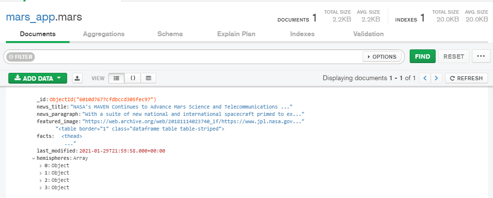
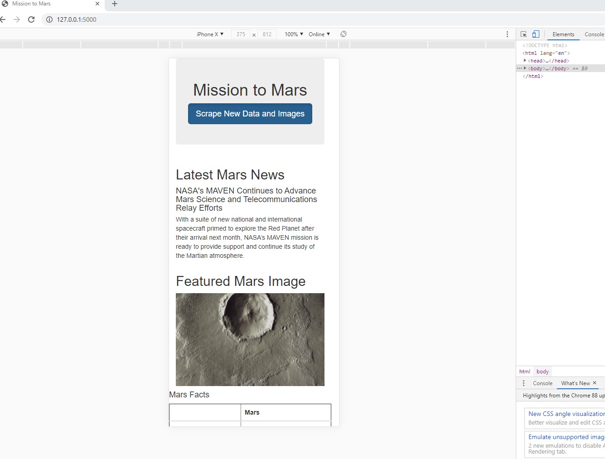
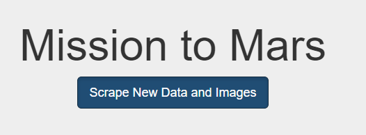
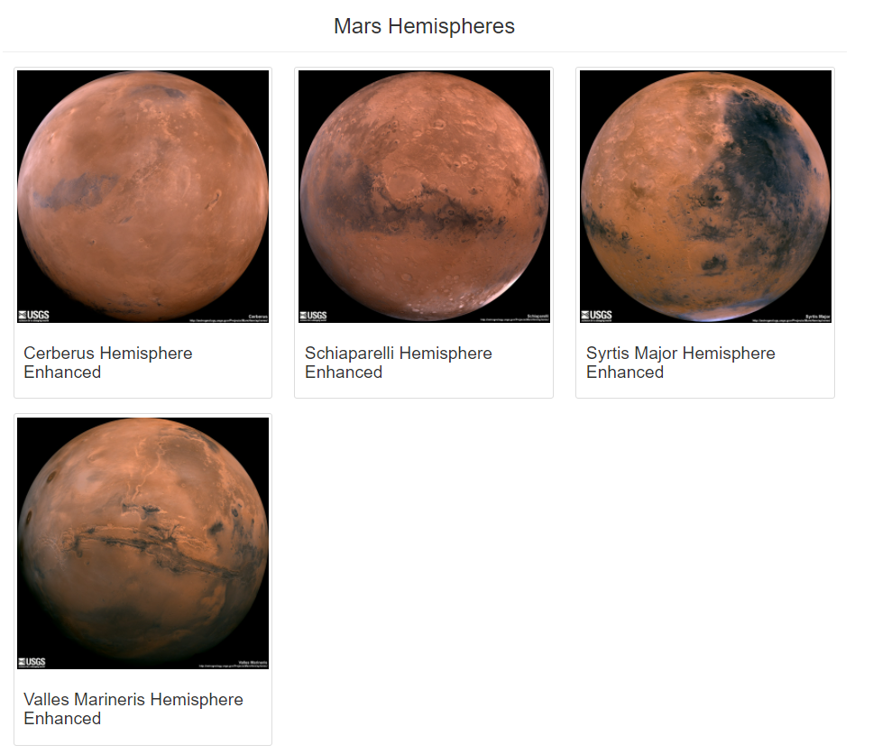

# Mission-to-Mars
Creating a web app using BeautifulSoup and Splinter to scrape images of Mars, using Mongo database to store scraped data, and using Flask and Bootstrap to display and design the web app.

1) Website scraping included in the Jupyter Notebook "Mission_to_Mars_Challenge.ipynb" with the new code for scraping the Mars Hemisphere images located in the "Challenge" portion of the notebook.

2) Upon execution, the scraped data is stored in the Mongo database illustrated below:

#### Mongo Database screenshot

3) Web app design was updated to be mobile-responsize as well as modified to stylize the button to scrape new data and to display the Mars Hemisphere images in thumbnails:

  ** Web app mobile-responsive tested to re-size for iPhone X.

#### Mobile-Responsive App screenshot

  ** Button to scrape new data updated to darken when hovered over and button text updated to reflect both new data and images.

#### Stylized Button screenshot

  ** Mars Hemisphere images configured to display as thumbnails that provides rounded borders per image.  

#### Mars Hemispheres screenshot

